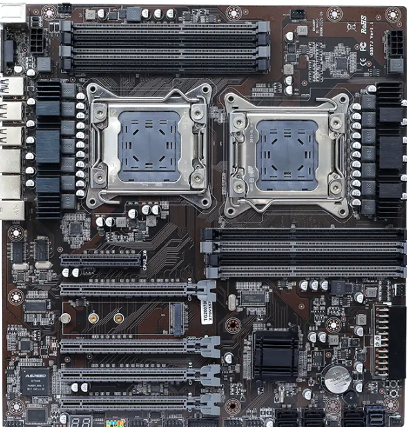
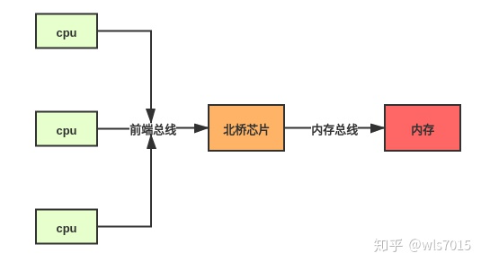
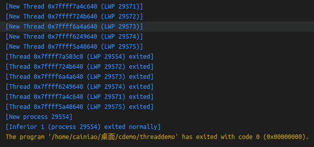

## 1.3计算机系统的体系结构

### 1.3.1单处理器系统

就是只有一个主中央处理器（CPU）的计算机，虽然各种IO设备也有自己的专门CPU，但是他们不是主CPU。主板上、散热风扇下面最大的一坨就是主CPU。

注意，目前来说，个人电脑已经没有单处理器系统，因为每台电脑的CPU都有多个核心，每个核心具备完成的CPU计算能力，被认为是多处理器系统。

### 1.3.2多处理器系统

有多个主CPU的计算机系统，组成架构各种各样，有的是将多个CPU都布局到主板上，如下图：



还有其他设计，什么模块化的、刀片式的等等。

共同特点只有一个：系统具有多个CPU。表面看起来多处理器系统一定会提升系统的计算能力，毕竟干活儿的人多了嘛。但是实际上，如果给你几个各有想法，不听指挥的手下，可能干活儿效率会更低。大家可能在某个工作上扯皮（谁也不干）或者抢着干同一个任务（竞争资源）。操作系统的功能之一就是搞定这些处理器（不听话的下属）。

- 多处理器的另外一个优点就是提高稳定性，策略有两种：

1）一是当某一个CPU出问题，其他CPU继续正常运行，只是系统整体算力下降一些，比如10个CPU，坏掉一个，系统算力下降10%。

2）二是书上说的容错（超过适度退化，成为容错）。我的个人理解就是：设定部分多余的CPU为冗余备份CPU，当某一个CPU故障，工作转移到备份CPU上执行。服务器整体性能不变。

- 根据多处理系统中，处理器任务的不同，分为两个类型：

1）非对称处理系统：每个处理器都有自己的任务，比如一个主处理器负责控制系统，分配任务给其他处理器，其他处理器处理自己分配的任务，或者向主处理器索要任务。

这种思路很常见，比如单位管理，也有一个主管。比如一些网络服务器程序，有一个线程专门用来监听客户端请求，然后把请求分配给其他线程去完成。

2）对称多处理系统（简称SMP）：所有的处理器大家任务角色都一样，没有主从关系

早期的多处理器系统比较简单，所有的CPU通过总线和总线上北桥芯片里面的内存控制器来访问内存，如下图：



这时候所有CPU访问内存的速度是一样，这种内存访问模型称为UMA（均匀内存访问）

后来CPU内部集成了内存控制器，CPU就可以直接访问内存，但是多处理系统的内存在物理设计上是分布的，有的内存，CPU可以通过内存控制器直接访问（称为本地内存，线路设计上距离CPU更近），有的内存不可以直接访问，需要通过一种叫做QPI总线的线路才可以连接，这部分内存访问起来速度当然慢一些，称为远端内存（也有人称之为远程内存）。这时候不同内存访问速度就不一样，这种内存访问模式称作：非均匀内存访问（NUMA）。大概结构如下图：


多处理器系统最近的发展是“多核处理器”，一个CPU内部集成多个核心，每一个核心都有自己的寄存器和本地缓存，就像多个真正的CPU一样。理论上，多核处理器比多个处理器性能更好，功耗更低，体积更小。现在的电脑处理器都是多核的，甚至手机处理器也是多核的。

### 1.3.3集群系统

集群系统没标准的定义。

一台服务器在一个系统内部集成多个CPU。

再进一步，我们可以将多个这样的服务器或者普通计算机组合成一个更大的系统，这个系统的每一个节点是单独的计算机。

显然，组成这样的系统，物理上最常用的就是互联网络：比如常用局域网络LAN（Local Area Network）连接

大部分集群系统的计算机共享存储，而且方式很多：比如计算机之间通过网上邻居共享文件，通过专门的磁盘阵列服务器（一种连接很多个硬盘的存储设备）共享数据、通过各种网络协议传递存储在本节点上的数据，通过数据库服务器访问数据。

和多处理系统一样，集群的各个节点之间，可以是非对称的，也可以是对称的。

关于对称集群和非对称集群，有多种解释和理解，只能说就像集群这个概念一样，没有统一标准。比如华为网站的介绍为：

> 所谓对称式集群文件系统是指集群中所有节点的角色和任务都相同，完全等价。在对称式集群文件系 统中，每个节点都很“聪明”，它们每时每刻都能够保持精确的沟通与合作，共同掌管着全局文件系统的元数据，每个节点要更新某元数据时都 会先锁住，这样其他节点就必须等待，就这样轮值执行任务，保证了文件系统元数据的一致性，同时也精确地保持着缓存一致性。各个节点间 沟通量很大。
> 
> 在非对称式集群中，只有少数节点是“聪明”的，其余都是傻节点。也就是说，只有少数节点（一般 为两个主备关系的节点）掌管着系统内全局的文件系统信息，其他节点均不清楚。当其他节点需要访问某文件时，需要首先联系这个聪明节 点，后者将前者要访问的文件所对应的具体信息（比如存放在后端哪个LUN的哪段地址，或者存放在哪个节点中）告诉前者，前者得到这些信 息之后便直接从后端的LUN或者对应节点中访问该数据。每个傻节点上安装一个代理客户端程序来与聪明节点通信。

和多处理系统的对称 非对称意思相符

但是为了考试，我们按照书上的解释来理解。

服务器集群在互联网公司运用很普遍。比如谷歌或者百度公司，当我们搜索数据的时候，搜索任务会被分配给集群系统成千上万个服务器中的某一台执行，而这台服务器在搜索数据库的时候，可能访问的是上千个数据库服务器中的某一个（数据库数据可以分布在不同的计算机系统上）。当其中某一台WEB服务器（提供互联网服务的服务器）出错的时候，还有其他节点的服务器可以正常工作。

所以集群系统可以提高系统的稳定性，提高系统性能（因为通过集群管理系统，可以提高<mark>并行</mark>能力，提供更强的计算能力）

书上P17页关于并行有解释，我举一个直观的例子：比如我编写了一个爬虫程序抓取网页上的每一个链接。常规操作是解析出所有的链接，然后一个个的去爬这个链接，这就意味着第k个链接爬过以后，才可以爬第k+1个链接。现在我感觉这么做太慢了，于是通过特殊的程序方式，我把这些链接分成若干组，比如30个链接，分成10组，每一组有3个链接，交给10台计算机去完成，这时候，显然速度快了很多。这10台计算机都是在单独并行运行，相互之间不存在互相等待。

这个思路其实也应用在所谓的多线程技术里面，这里简单举例说一下，以C++语言为例吧。

线程可以理解为程序的一个函数，任何C++语言程序，至少有一个main函数，所以，根据有些说法，一个程序至少有一个线程，称为主线程（事实可能并非如此，或者不同操作系统处理方式不同，具体证据看下面的代码和分析）。

这个例子我们创建五个线程，为了演示各个线程函数是独立执行的，而不是像普通函数那样：按照调用次序一个个顺序执行的，我们在每一个线程内部设置了一个随机数，然后让这个线程按照这个随机数for循环一遍，模拟每一个线程的工作量。

理论上，main函数里面的for循环连续快速创建5个线程，可以认为是一瞬间同时创建、并运行5个线程，如果是普通函数，则第一个函数运行后，再执行第二个函数，直到第五个函数执行完毕。但是多线程模式不同，每一个线程都是独立并行运行的，第二个线程的开始不必等待第一个的结束。

还是看下代码

```cpp
#include <iostream>
// 必须的头文件，这个库里面的thread类创建线程很方便
#include <thread>
#include <random>
using namespace std;
//定义线程为5个线程
#define NUM_THREADS 5

// 线程的运行函数
void get_link(int thread_id)
{
    cout<<"线程"<<thread_id<<"开始运行"<<endl;
    int loops=rand();//产生一个随机数
    for(int i=0;i<loops;i++);//用循环实现延迟，否则所有线程运行一闪而过
    cout << "我是第"<<thread_id<<"个创建的线程，我实现了"<<loops<<"次随即循环" << endl;
}

int main()
{
    int i;
    thread t[NUM_THREADS];// 创建一个线程对象的数组
    for(i = 0; i < NUM_THREADS; ++i)
    {
        //参数依次是：线程对应的函数，传入的函数参数
        t[i]=thread(get_link, i);
        t[i].detach(); //detach()函数让线程独立运行，不必等待结束才运行下一个线程
    }
    //让main主程序等待线程结束之后再结束，否则线程还没结束，主程序就结束了
    //这会强制结束主程序创建的子线程
    pthread_exit(NULL);
    cout<<"manin()主函数退出"<<endl;
    // return 0;
}
```

程序可能的运行结果如下：

线程0开始运行
线程1开始运行
线程2开始运行
线程3开始运行
线程4开始运行
我是第1个创建的线程，我实现了846930886次随即循环
我是第3个创建的线程，我实现了1714636915次随即循环
我是第2个创建的线程，我实现了1681692777次随即循环
我是第0个创建的线程，我实现了1804289383次随即循环
我是第4个创建的线程，我实现了1957747793次随即循环

提示，如果代码中的t[i].detach()改成t[i].join()，那么线程的运行和结束将一个个按照创建的次序执行，也就是第0个，然后第1个，以此类推。类似普通函数调用。这种情况称为线程的阻塞模式。前面的线程还没运行完，挡住了后面线程的执行，后面的线程只能等待前面老兄让路才可以执行。

- 如果我们使用vscode调试运行这个程序，会发现下面的调试控制台输出下面内容：



我们看出以下内容：

1）这些东西提示线程的创建和退出顺序，可以看出线程的创建和退出顺序未必一致，说明线程一旦以非阻塞模式运行，各个线程就像脱缰的野狗一样不可控制，所以多线程程序的调度很重要。

2）

3）主程序的进程（process，也就是这个运行的程序）也有一个线程thread和lwp与之对应，进一步测试，写一个简单的helloworld程序，就没有这东西。我的理解就是，只有多线程程序，操作系统才会为运行的程序创建一个主线程。这个可以问老师求证。
