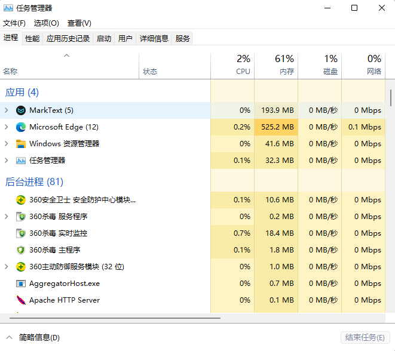

## 1.4操作系统的结构

操作系统最重要的一个能力就是要具有多个程序一起运行的能力（多道程序设计）。

从这一节开始，有许多名词混合使用，任务、作业、进程、程序、线程等。

任务、作业、进程三个词汇：

任务：就是用户要求计算机做的一项工作，要达到这个目的，肯定会运行一个或者多个程序，产生一个或者多个进程，甚至可能包括多个线程。

作业：源自早期的批处理系统，早先的系统是批处理系统，要完成一个任务，需要我们提前计划好怎么做，然后把工作流程用“作业控制语言”组织起来形成一个脚本，然后系统执行这个脚本。现代操作系统仍然支持，比如windows支持批处理脚本，Linux，Uninx也支持脚本。举个最最简单的例子，我们创建一个脚本，编译/home/cainiao/目录下的test.cpp文件并运行，可以创建一个批处理脚本test1.sh：

```shell
cd /home/cainiao/
g++ test.cpp -o test
./test
```

进程：貌似总结过，书上也有，程序的运行状态就是进程，包括内存中的程序代码，程序运行时使用的数据等。

很多时候这三个词汇混合使用，结合书上的上下文意思理解，都是指进程。也就是说这三者的概念在模糊趋同。比如windows和Linux里面，打开任务管理器，看到的都是进程，点击某一个进程，可看到它使用的CPU、内存资源，以及它对用的线程。



要实现同时运行多个任务，操作系统就需要在不同任务之间切换，不可能一个任务不处理完就不运行其他程序。同时，这么多任务不可能同时放在内存中等待运行，部分作业可能会暂时放在**作业池**的数据结构中，现代操作系统中，这个数据结构通常存放在系统的虚拟内存文件中。所以书上说硬盘的作业池，也正确。

虚拟内存：就是在硬盘上开辟一个空间用来模拟系统的内存，弥补系统内存不足的尴尬，操作系统可以直接通过寻址访问虚拟内存，就像对待真正的内存一样。在linux系统中，虚拟内存是一个swap分区，叫做“交换分区”（因为虚拟内存的数据要经常和真实内存的相互调度、交换）。windows系统是一个隐藏起来的文件，通常在C盘，文件名：swapfile.sys

虚拟内存和物理内存用户不可感知，一般当作一个整体：逻辑内存。

CPU分时，是操作系统实现多任务的最初、也是目前为止最主要的策略。

分时系统把CPU的运行时间划分为一个个的时间片，不同的程序通过操作系统某种调度策略，轮流在CPU上运行指定的时间片长度，比如程序A运行10毫秒，接着程序B运行10毫秒。

总体来说，就是这样子，所有书上都这么写，但是如果程序A正在执行的时候需要IO数据，比如需要键盘出入，这时候系统怎么处理，很多文章、资料写的都很笼统，甚至有些不一致。

查了很多资料，我的理解是这样子，供参考：

当进程A遇到IO请求的时候，比如要求键盘输入数据，我们的代码一般是cin,或者getchar等函数，学习C++会发现，如果键盘缓冲区有数据，cin不会等待键盘输入，会直接取回数据，所以有时候需要清空缓冲区。进程A需要数据的时候，会发起一个系统调用（通常系统调用会被封装在开发语言的运行库里面供我们使用），该调用在内核中执行，负责获取键盘缓冲区数据并传递给进程A，同时会把进程A放到一个“等待”队列里面，具体的实现细节网上说的也是不详细，闹不明白。然后获得数据的进程被系统放在一个“就绪”队列中，等待着被系统在适当的时间片执行。在这个过程中，因为进程A被放到等待队列，不再CPU执行，CPU会接着处理其他在就绪队列的程序。

分时系统还涉及CPU的使用问题，是按照优先级运行内存中的多个进程？还是按照进程的性质分配CPU的运行时间？等等。
