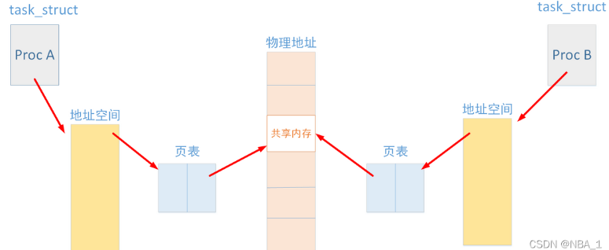

设计操作系统和设计其他软件系统的整体思路都差不多：

首先要明确系统的设计目标：

1）我们要提供哪些服务

2）我们要为用户提供什么样的接口（比如哪些交互，什么权限等），需要为程序员提供什么接口(对于普通，可能有二次开发，因此也存在接口)。

3）我们实现这些功能，需要设计多少模块（系统组件），每个系统组件实现什么功能，它们之间如何协调工作

## 2.1操作系统的服务

这里有一个共享内存。前面好像说过，每个进程只能访问自己的内存空间，这是系统安全性的需要，但是凡事都有特例，有时候不同进程之间也需要相互协作、通信。这时候的一种解决办法就是让他们共享同一个内存，大概原理如下：

共享内存的通信原理
在Linux中，每个进程都有属于自己的进程控制块（PCB）和地址空间（Addr Space），并且都有一个与之对应的<mark>页表（一种特殊的数据结构，放在系统空间的*页表*区，存放逻辑页与物理页帧的对应关系）</mark>，负责将进程的虚拟地址与物理地址进行映射，通过内存管理单元（MMU）进行管理。两个不同的虚拟地址通过页表映射到物理空间的同一区域，它们所指向的这块区域即共享内存。如下图：

Linux提供了几个函数用户创建共享内存，具体例子，感兴趣可以看：

[shmget_百度百科](https://baike.baidu.com/item/shmget/6875075?fr=aladdin)

记账：类unix系统，比如Unix，Linux都有这个功能，只不过默认不安装，这个功能可以记录用户、进程执行的信息，比如时长等，保存到一个账单文件（其实就是系统的日志文件）中。怎么收费需要根据账单数据和自己的策略，自己开发程序。

其他没啥不好理解的问题。
