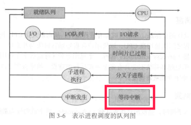

### 3.2.1调度队列

操作系统内部都多个队列保保存相同状态的进程：

比如作业队列、就绪队列，等待队列

书上说的设备队列，我猜测可能就是其他书上说的等待队列。因为字面上，两个队列的作用相同，另外，等待队列也存在多个。为什么等待队列存在多个？因为不同进程等待的事件不同，如果只有一个等待队列，操作系统接收到事件，就要顺序查找所有进程是否在等待这个事件。效率比较低。

图3-6的理解：

红色部分，我的理解是：所谓的等待中断，就是系统调用。只有申请系统调用，才可能不会因为IO等待而被转入IO队列。因为系统调用作为特殊的中断类型，未必就一定是IO操作。

下面的截图是书中的解释，红色划线部分貌似是对“等待中断”的解释，但是我知道的强行中断，并且能不退出程序，把进程放到就绪队列的只有CPU时间片到发出的时钟中断。但是这个在图中已经有了。

总结：

1）系统存在多个进程队列，队列的每一个元素是进程的PCB

2）一个PCB在不同情况下，会从一个队列移到另一个队列。

3）进程有5中状态，3中基本状态

### 3.2.2调度程序

进程会在不同的队列之间迁移，这就需要有合适的调度算法，配合相应的调度程序完成这一任务。

调度程序一般分为：

1）长期调度：将作业从磁盘的作业池调入内存，进入就绪队列，又称为作业调度程序。

2）短期调度：对内存就绪队列的进程分配CPU执行，又称为CPU调度程序。

3）中期调度：当系统资源（比如通常是内存）不足，或者系统的多道程序处理任务太重的时候，可以将进程从内存移出，调入磁盘（我的理解是磁盘的交换分区或者虚拟内存的，这可能也是中期调度又称交换的原因吧），之后再将进程调入内存执行。

个人理解，中期调度和长期调度不是互补的关系，就是说，并不是中期调度只实现进程内存到磁盘，长期调度实现磁盘到内存。好像而这分工合作一样。中期调度自己实现完整的磁盘和内存相互交换，因为长期调度程序调度的是磁盘上静态的作业文件，而中期调度在磁盘上要保存的是进程的完整内存状态，这可能包括保存进程的PCB，这样子才能在下次进入内存的时候，不必从头开始执行。二者的数据结构不一样。感觉中期调度模拟的是进程被CPU切换时候的操作。

### 3.2.3上下文切换

上下文的意思前面说过，这个词在其他方面也经常出现，基本上可以理解为之前和之后的运行状态。

比如自然语言处理中，一个单词的上下文，就是前面和后面的几个单词。

进程因为各种原因要在CPU中经常调入调出，下次恢复执行的时候，就需要恢复以前的运行状态，接着执行，这就需要在调出CPU的时候（书中说的是中断发生时，也对），能够保存进程的当前状态。这种进程状态的切换就称作上下文切换。

上下文切换的时候，进程的状态保存在PCB里面。
