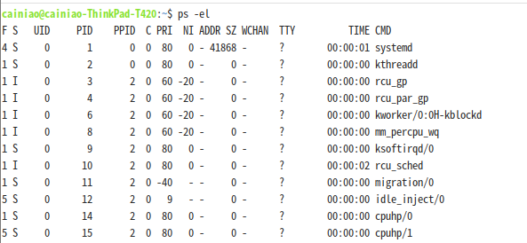
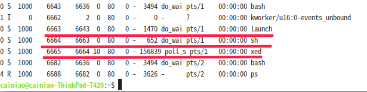
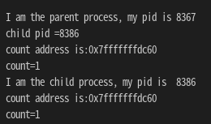
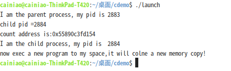
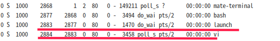
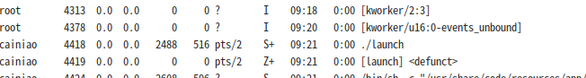

本节讨论进程的创建机制

### 3.3.1进程创建

进程能创新新的子进程，前面好像也说过。

Linux可以用ps -el命令列出当前的所有进程，显示他们的PID（进程标识符），以及PPID（父进程标识符）,进而展示进程和子进程之间完整的父子关系，如下图



子进程所需的资源可以从操作系统重新分配，也可以从父进程那里得到资源的子集。后者可以防止创建过多的进程，避免系统超载。

父进程可能会向子进程传递参数，比如下面的C++代码，演示了进程创建子进程，并且传递参数的例子（这个例子中，程序会调用shell打开文本编辑器xed，并且将launch.cpp文件名作为参数传递给xed，打开源代码）

launch.cpp

```cpp
#include <stdio.h>
#include <string>
#include <sys/wait.h>
using namespace std;

int main(){
    string process="xed ./launch.cpp";
    FILE * f=popen(process.c_str(),"w");
    pclose(f);
    wait(NULL); //等待子进程完成
}
```

代码编译:g++ launch.cpp -o launch

在linux shell运行这个程序: ./launch，然后我们用ps -el命令显示进程列表，结果大概如下（我的系统是Linux Mint,一个基于ubuntu的发行版）：



可以看出，xed的父进程ID是6664,对应的是sh,而sh的父进程ID是6663，,即我们的launch程序。

在Linux和Unix中，可以通过系统调用fork()来创建一个自身的子进程（父进程的复制品），父进程和子进程一开始共享同一个内存空间，下面的代码演示了这个系统调用方法和特征：

```cpp
#include <iostream>
using namespace std;
#include <unistd.h>  
#include <stdio.h>   
int main()   
{   
    pid_t fpid;  
    int count = 0;  
    fpid = fork();   //返回子进程的进程ID
    if (fpid < 0)     //如果返回负数，则出错了
        cout<<"failed to fork";   
    else if (fpid == 0)  //如果fork返回0，则下面进入子程序 
    {  
        cout<<"I am the child process, my pid is  "<<getpid()<<endl;   
        count++;  
        cout<<"count address is:"<<&count<<endl;
    }  
    else   //如果fork返回值大于0，则依旧在父进程中执行
    {  
        cout<<"I am the parent process, my pid is "<<getpid()<<endl;
        cout << "child pid =" << fpid << endl;
        count++;  
        cout<<"count address is:"<<&count<<endl;
    }  
    printf("count=%d\n", count);  
    return 0;  
}
```

运行结果如下：



程序运行，一开始是父进程，此时，fork()返回创建的子进程的id，当子进程创建后，由于和父进程一样的执行代码，子进程此时执行fork()返回的就是0，表示这时候是在子进程运行。同时，父进程和子进程都打印count变量的地址，二者一致，表明他们此时共用同一个内存空间。

那么什么时候子进程有复制的，属于自己的内存空间呢？

Linux的fork()使用写时拷贝(copy-on-write或者写时复制)实现。写时拷贝是一种可以推迟甚至避免拷贝数据的技术。fork()后，内核此时并不复制整个进程的地址空间，而是让父子进程共享同一个地址空间。只在需要写入的时候才会复制地址空间，从而使各个进程拥有各自的地址空间。也就是说，资源的复制是在需要写入的时候才会进行，在此之前，只有以只读方式共享。

fork()出的子进程，可以通过exec系统调用，这时候，发生写时拷贝，系统给子进程安排一个独立的内存空间，加载二进制文件到内存中。可以对上面的代码略微修改，验证一下：

```cpp
#include <iostream>
#include <unistd.h>  
#include <stdio.h>   
#include <sys/wait.h>
using namespace std;

int count = 0; 
int main()   
{   
    pid_t fpid;  

    fpid = fork();   //返回子进程的进程ID
    if (fpid < 0)     //如果返回负数，则出错了
        cout<<"failed to fork";   
    else if (fpid == 0)  //如果fork返回0，则下面进入子程序 
    {
        cout<<"I am the child process, my pid is  "<<getpid()<<endl; 
        cout<<"now exec a new program to my space,it will colne a new memory copy!"<<endl;
        execlp("vi","vi","./launch.cpp",NULL); //exec一个程序
        cout<<"count address is:"<<&count<<endl;
    }  
    else   //如果fork返回值大于0，则依旧在父进程中执行
    {  
        cout<<"I am the parent process, my pid is "<<getpid()<<endl;
        cout << "child pid =" << fpid << endl;
        cout<<"count address is:"<<&count<<endl;
        wait(NULL);//等待子进程完成
    }  
    return 0;  
}
```

运行会发现：子进程不再执行：cout<<"count address is:"<<&count<<endl;，因为进程空间从代码到数据已经替换成了被加载程序的。另外一种说法是丢弃了旧进程，系统开了一个新的进程，我觉得这个观点是错误的，因为通过ps -el命令观察，vi程序的进程ID和launch程序产生的子进程ID相同。说明并不是产生了一个新的进程。见下图：





### 3.3.2进程终止

1）进程可以在代码的任何地方调用exit()强行结束自己，从内存中删除。

2）main主函数return 的时候，会隐式的调用exit()

3）有时候，一个进程可以终止另一个进程，当然，一般是父进程终结子进程，否则任何一个程序可以干掉其他正在运行的程序，系统就乱套了。这时候父进程需要知道子进程的PID。原因树上说的有，方法很简单，调用kill(PID,SIGKILL)即可。

看下面的代码，主进程创建子进程->子进程exec() vi程序打开源代码->主进程等待5秒钟->kill子进程

代码和上面的基本一样：

```cpp
#include <iostream>
#include <unistd.h>  
#include <stdio.h>   
#include <sys/wait.h>
using namespace std;

int count = 0; 
int main()   
{   
    pid_t fpid;  

    fpid = fork();   //返回子进程的进程ID
    if (fpid < 0)     //如果返回负数，则出错了
        cout<<"failed to fork";   
    else if (fpid == 0)  //如果fork返回0，则下面进入子程序 
    {
        cout<<"I am the child process, my pid is  "<<getpid()<<endl; 
        cout<<"now exec a new program to my space,it will colne a new memory copy!"<<endl;
        execlp("vi","vi","./launch.cpp",NULL); //exec一个程序
        cout<<"count address is:"<<&count<<endl;
    }  
    else   //如果fork返回值大于0，则依旧在父进程中执行
    {  
        cout<<"I am the parent process, my pid is "<<getpid()<<endl;
        cout << "child pid =" << fpid << endl;
        cout<<"count address is:"<<&count<<endl;
        sleep(5);
        kill(fpid,SIGKILL);
    } 
    return 0;  
}
```


僵尸进程是当子进程比父进程先结束，而父进程又没有回收子进程，释放子进程占用的资源，此时子进程将成为一个僵尸进程。如果父进程先退出 ，子进程被init接管，子进程退出后init会回收其占用的相关资源.

僵尸进程的产生测试很简单，上面的代码中，涉及子进程的部分调用exit()即可，这时候因为主进程代码没有wait()，子进程会变成僵尸进程，可以用ps -aux查看进程状态，僵尸进程的状态是“Z”，代码如下，截图如下：


```cpp
#include <stdio.h>
#include <stdlib.h>
#include <sys/types.h>
#include <unistd.h>
int main(int argc, const char *argv[])
{
	pid_t pid = fork();//再创建一个进程
	if(pid == 0)
	{
		printf("我是子进程");
		exit(0);
	}else if(pid > 0)
	{
		printf("我是父进程");
        sleep(10);
	}else
	{
		printf("创建失败\n");
	}
	return 0;
}
```



如果父进程没有调用wait等待子进程结束，子进程就成了“孤儿进程”，Linux的解决方案是把init作为子进程的父进程。init定期调用wait，手机任何孤儿进程的退出状态，并释放孤儿进程的PID和PCB
