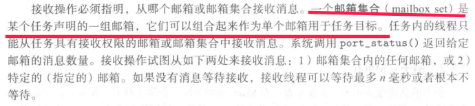

## 3.5系统例子

### 3.5.1 POSIX共享内存

POSIX是电气与电子工程师协会（Institute of Electrical and Electronics Engineers,简称IEEE）发布的一个标：可移植操作系统接口（Portable Operating System Interface of UNIX，缩写为 POSIX ）

这套标准涵盖了很多方面，比如Unix系统调用的C语言接口、shell程序和工具、线程及网络编程。POSIX标准定义了操作系统应该为应用程序提供的接口标准。

书上的代码在编译的时候需要加上 -lrt参数在能通过，据说是连接到什么实时扩展库。这个库提供对shm_open等API的支持，否则系统会提示： undefined reference to `shm_open'

默认情况下，Linux上的gcc编译器支持的是SYSTEM V的API标准。二者在进程通信的接口API定义的不一样。

代码自己可以试着输入运行一下

### 3.5.2Mach

没接触，没例子

但是书中提到，mach中，邮箱称为端口，突然有种茅塞顿开的感觉，想起了3.4.2.1小结里面一些疑惑的问题。如果端口就是邮箱，邮箱就是端口，那么3.4.2.1里面，邮箱通信的三个特点就有了直观的感受（这里说的是软端口，非硬件连接的端口）。这三点如下：

这种通信具有如下特点：

1. <mark>两个进程共享同一个邮箱才可通信</mark>

2. <mark>一个链路可以与两个或更多进程相关联（书中假设的P1，P2，P3共享一个邮箱A的例子，我认为就是对这种情况的进一步分析）</mark>

3. <mark>两个进程间可以有多个不同的链路，每个链路对应于一个邮箱，这样子就会存在多个邮箱</mark>。

1）两个进程共享同一个邮箱才可通信：相互通信的进程，必须要通过相同的端口，比如浏览器访问网络服务器的80端口获取数据，或者通过80端口上传文件到服务器。

2）一个链路可以与两个或者更多的进程相关联：比如我们可以开多个浏览器，访问同一网站的80端口，服务器进程从80端口（或者说是消息邮箱）的连接请求队列里面，处理一个个的连接请求。

3）两个进程间可以有不同的链路，每个链路对应于一个邮箱：比如web服务器软件ngix等，可以开多个端口，每个端口提供不同的服务：80端口提供web网页服务，8081端口可以提供网站后台管理网页的服务。浏览器可以访问两个端口，获取不同的服务。还有一种情况是，每一个通信的进程，都有一个自己的接手邮箱，单次发送或者接收连接，使用单独一方的邮箱。

和我们发电子邮件信息几乎一样，间接通过邮箱通信，发送的消息包括头部和数据正文两部分。头部包含接受消息的邮箱（比如浏览器向服务器80端口发送连接请求的url），如果发送端希望收到回复数据，消息头部还会包含发送端的邮箱号（发送端用于接收消息的邮箱）。比如浏览器访问web服务器的80端口，实际上浏览器程序在发送消息里面，也会附上自己进程的端口，便于接受回传的数据。只不过浏览器的端口一般是随机产生或者遵循某一个规则产生的，不会和自己电脑中其他进程的端口产生冲突。

 这里简单说一下端口，也能层面了解为什么邮箱的优点是避免了“直接”通信硬编码的方式太僵化的问题。

简单说，端口可以看作是一个进程的编号，但是和PID这个编号不同，PID在程序每次运行的时候都是不同的，但是端口在每次程序运行的时候，大部分都是固定的（至少提供服务的进程，申请端口是固定的），也就是说每次程序运行，这个端口对应的就是这个进程。如果进程A在申请端口的时候，这个端口已经被别的服务进程申请了，那么这个进程就不能正常工作。邮箱应该也是如此。

书上说一次只能有一个任务可以拥有邮箱或从邮箱接收，大概就是类似端口一样，同一个端口只能有一个进程可以占用。至于所说的这些权利可以转给其他任务，我的理解，大概意思就是说：一个端口可以这这个进程占用，也可以是其他进程占用。比如web服务器进程，80端口可能是被nginx占用，也可能是其他服务器软件，比如apache占用。不知道理解对不对。作者写的意思似乎有些模糊，不具体。

当接收者的邮箱已经满的情况下，发送进程的四个选择，其中第四个选择我的理解如下：

* 暂时缓存消息，发送者进程A去做其他任务，这时候，操作系统负责在接收者进程B的邮箱有了空间，可以存放消息的时候，通知发送者：“你可以发送消息啦，对方邮箱有空间了”。进程A这时候将原先缓存的消息取出来，发送到进程B接受消息的邮箱。刚才说的进程A去做其他任务，在这个过程中，进程A不能再次向进程B接收消息的邮箱再次发送其他消息，因为已经知道对方邮箱满了，再次发送消息是无意义的行为。不知道理解的对不对。

* 对上面的进一步分析是“谁”来暂存消息，合理分析、结合书中提到的打印机驱动的例子，我认为是操作系统来完成这一功能，接收进程的邮箱（或者端口）应该是操作系统在内核态维护，否则进程A得知进程B的邮箱可用的时候，需要再次申请系统调用，重新发送消息，在用户态和内核态之间切换，效率比较低。但是如果是内核管理缓存的消息，则省略了这一步骤，内核直接把缓存数据发送给B的邮箱即可。另外，这和我们在打印文件时的只管感受符合，实际打印文件的时候，我们的字处理软件可以给打印机发送多个打印任务去处理，并不存在因为打印机忙碌（可以认为打印进程的邮箱只能存放一个消息），就不能发送打印指令的情况，我们可以在windows的打印任务管理器里看到这些打印任务被排队缓存了，当自己的打印任务开始打印的时候（进入打印进程的邮箱），操作系统会在状态栏提示：“正在打印中...”，这样的状态信息，由发送进程获取不合理。

<mark>下面画红线的内容不理解，也没见过具体的实例，问老师吧</mark>

### 3.5.3Windows

Windows进程也采用消息传递机制通信
