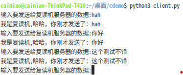

客户服务器是一种计算模式，一切将服务提供者（服务器）和服务消费者（客户端）分开的分布式计算模式。

因此，客户服务器不是通信方式，反而可以采用其他各种进程间的通信方式：比如共享内存、网络套接字等。

### 3.6.1套接字

套接字（socket），英文意思是“插座、插口”，不知道哪一天被人翻译成了“套接字”这么一个名字，我觉得愿意更形象。

socket是对网络通信端点的抽象（用编程来展现），在网络通信中，起到承上（要通信的进程）起下（网络通信协议）的作用，socket提供接口给通信的进程使用，并且负责通信过程中具体通信协议的实现。

每一个socket由IP地址和通信端口构成。

socket提供三种类型的套接字（不仅仅限于书中说的java）：

1）面向连接的TCP套接字

或者说基于TCP协议的套接字，这种通信方式，需要在接收方和发送方之间建立并保持连接（connect）才可以传递数据。

2）面向无连接的UDP套接字

基于UDP协议的套接字，这种通信方式不需要通信双方建立和保持连接，发送方只管发送，至于数据能不能被接收，从协议上不保证。具体说，就是用底层协议上来看，通信过程中不包含数据接收发送过程中的确认消息沟通。举例来说，TCP协议通信过程中，发送消息前需要connect，connect返回正确才可以通信。而udp则不需要，直接sendto即可

3）原始式套接字(SOCK_RAW)该接口允许对较低层协议，如IP、ICMP直接访问。（可能自己要实现特殊的通信协议）

基本上所有语言的socket通信都大同小异，服务器先监听有没有通信需求（listen），如果有则accept。

对于TCP，客户端先connect，然后send数据

对于UDP，客户端直接send数据

举一个最简单的python的例子

#### 最简单的TCP通信

```python
import socket   # 导入 socket 模块
# 建立一个服务端
server = socket.socket(socket.AF_INET,socket.SOCK_STREAM)
server.bind(('0.0.0.0', 8989)) #定要监听的端口
server.listen(5) #开始监听 表示可以使用五个链接排队
conn,addr = server.accept() #等待链接
while True:# conn就是客户端链接过来而在服务端为期生成的一个链接实例
    data = conn.recv(1024).decode()  #接收数据,并且把接收的字节数据转字符串
    if data:
        if(data=="q"): #如果客户端发送q，则服务器端关闭连接并退出
            conn.close()
            break
        else:
            print('收到从',addr,"发送的消息:",data) #打印接收到的数据
            print("发送回复消息")
            return_msg="我是复读机,哈哈，你刚才发送了："+data
            conn.send(return_msg.encode()) #然后再发送数据,数据必须转换为byte
```

```py
import socket# 客户端 发送一个数据，再接收一个数据
client = socket.socket(socket.AF_INET,socket.SOCK_STREAM) #声明socket类型，同时生成链接对象
client.connect(('127.0.0.1', 8989)) #建立一个链接，连接到本地的6969端口
while True:
    msg = input("输入要发送给复读机服务器的数据:")
    client.send(msg.encode('utf-8'))  #发送一条信息 python3 只接收btye流
    data = client.recv(1024) #接收一个信息，并指定接收的大小 为1024字节
    print(data.decode()) #输出我接收的信息
    if msg=="q":
        break
```

服务器短运行结果如下：


客户端运行结果如下：



#### 最简单的UDP通信

```py
import socket   # 导入 socket 模块
# 建立一个服务端
server = socket.socket(socket.AF_INET,socket.SOCK_DGRAM)
server.bind(('0.0.0.0', 8989)) #定要监听的端口
#conn,addr = server.accept() #等待链接
while True:# conn就是客户端链接过来而在服务端为期生成的一个链接实例
    msg = server.recvfrom(1024) #msg信息封装了客户端的消息和地址端口
    data=msg[0].decode()
     #接收数据,并且把接收的字节数据转字符串
    client=msg[1]
    if data:
        if(data=="q"):
            server.close()
            break
        else:
            print('收到从',client,"发送的消息:",data) #打印接收到的数据
            print("发送回复消息")
            return_msg="我是复读机,哈哈，你刚才发送了："+data
            server.sendto(return_msg.encode(),client) #然后再发送数据,数据必须转换为byte
```

对比代码发现，UDP方式下，server不需要listen和accept等待连接，发送消息需要指明谁接收

客户端代码如下：

```py
import socket# 客户端 发送一个数据，再接收一个数据
client = socket.socket(socket.AF_INET,socket.SOCK_DGRAM) #声明socket类型，同时生成链接对象
while True:
    msg = input("输入要发送给复读机服务器的数据:")
    server=("127.0.0.1",8989)
    client.sendto(msg.encode('utf-8'),server)  #发送一条信息 python3 只接收btye流，所以字符串要encode成比特流
    data = client.recv(1024) #接收一个信息，并指定接收的大小 为1024字节
    print(data.decode()) #输出我接收的信
```

对比TCP socket，发现客户端不需要connect，只需要sendto即可（当然也需要指明谁接收）

### 3.6.2远程过程调用:RPC

简单直白说，RPC就是在分布式的两个计算机系统之间，客户端调用远程服务器上的服务进程。

比如 A (client) 调用 B (server) 提供的remoteAdd方法：  
首先A与B之间建立一个TCP连接；  
然后A把需要调用的方法名（这里是remoteAdd）以及方法参数（10， 20）序列化成字节流发送出去；  
B接受A发送过来的字节流，然后反序列化得到目标方法名，方法参数，接着执行相应的方法调用（可能是localAdd）并把结果30返回；A接受远程调用结果,输出30。  
RPC框架就是把我刚才说的这几点些细节给封装起来，给用户暴露简单友好的API使用。

因为RPC主要发生在不同机器，不同系统之间，因此，RPC通信的消息结构必须明确。

因为网络可能出现错误，RPC可能执行失败或者多次，为了解决这个问题，设计者通常采用两种策略：

* 最多一次

* 正好一次

书上说的明白，不再赘述。书上所说的时间戳，其实就是一个整数，记录格林威治时间1970年01月01日00时00分00秒(北京时间1970年01月01日08时00分00秒)起至现在的总秒数。

显然，消息中的时间戳应该是客户端生成并加入进去的。

RPC服务的端口可以硬编码（端口号写入程序代码），也可以通过一个“交会服务程序”的查询来获得，书上说的也大概原理比较清楚，具体细节没说。不过脑补分析一下，RPC服务程序必然会在某一个表格中注册自己的API及端口等信息，以便月老查找。

### 3.6.3管道通信

管道通信
