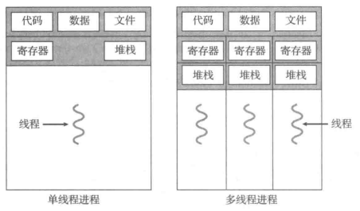

单线程和多线程程序的差异：

从上图总结：

1）线程是进程代码的一部分

2）各个线程天然的继承了所属进程的数据、文件、代码

3）线程的本质是一段代码或一个函数，因为线程可能会被中断、线程内部的局部变量需要存储，因此，每个线程都有自己的堆栈以及寄存器（所谓的有自己的寄存器，实际就是有一个类似于PCB的数据结构保存寄存器的值，以便于线程再次被CPU调度的时候可以接着执行，和进程的逻辑一样）。

### 4.1.1动机

...

### 4.1.2优点

* 响应性。以前编写信息管理系统，通常需要在点击一个按钮之后，实现某些CPU占用率比较高的，耗时比较长的操作，这时候，程序会等待这个操作的完成，往往会导致整个程序都会没反映。解决这个问题的办法就是采用多线程，新建一个后台线程去执行数据处理操作，主进程（GUI界面）就不必阻塞等待操作完成。

*  资源共享。比如网络发重共享同一个表格，共同填写这个表格中的数据。

这一节其他不再赘述。难点少。
