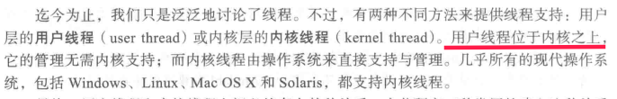

先看书上这句话：

位于内核之上什么意思？

用户线程位于用户内存空间，这个“内核之上”或许是从操作系统的结构来说的吧，相对来说，内核是底层，应用层是高层。

用户线程，就是运行在用户空间，由用户自己编程实现调度的线程。用户线程对内核透明（内核看不到，无法感知），内核也不参与线程的调度管理，从内核角度看，只有一个程序的进程。

内核线程：操作系统自己支持管理的线程。现代的操作系统都支持内核线程：操作系统在实现的时候，内部很多功能就是多线程的。内核线程由内核管理。

 这里有一篇文章，讨论了用C语言实现用户态线程的方法，[课程设计-----C语言实现用户态线程_山有木兮°的博客-CSDN博客](https://blog.csdn.net/Wannna/article/details/107118351)

网上还有其他类似的文章探讨这个，可以搜索“C语言实现用户态线程”。有时间或者有必要的话可以研究一下。

用户线程可以交由内核管理，这样的好处就是内核可以在多个处理器上调度来自同一进程的多个线程，同时，一个线程阻塞的话，内核可以调度进程的其他线程。

当把用户线程交由内核控制的时候，内核就会像控制进程那样，在内核中创建一个线程的“控制块（类似PCB）”，目的当然是为了管理调度线程（只有内核控制的多线程才可以利用SMP的特点，才是真正的并行的多线程），但是内核资源是有限的，而我们的进程开出的线程往往很多，假如一个程序有100个线程，10个这样的程序就有1000个类似进程的线程，系统开销会很大，也会有其他不方便的缺点。

因此，操作系统采用以下几种办法实现真正的多线程。

### 4.3.1多对一模型

所谓映射多个用户线程到一个内核线程，我的理解是这样的：在多对一模式下，不管用户进程有多少个线程，内核始终只允许调度其中的一个线程运行。在单处理器系统中，这和用户态线程没有区别，在多处理器系统中，再多的CPU也没用，顶多支持两个CPU：一个运行进程，一个运行内核管理的那个线程。

缺点书上说了，不再赘述。不知道理解的对不对，可以问老师。不过书上168这么说：

从书上的意思，好像：即便是多处理器系统，内核管理的这个线程也不会在其他CPU上运行，而是占用所属进程的CPU时间，因为书上说“并未增加并发性”。你问下老师。

### 4.3.2一对一模型

就是对于用户进程的每一个线程，内核创建对应的线程控制块，并为他们分配CPU等资源运行，内核管理这些进程。有点事并发并行性能好，缺点是开销大，所以大多数支持一对一的操作系统，都限制了系统总体支持的线程数量。

### 4.3.3多对多模型

多对多模型是上面两个模型的折衷方案，将N个用户线程映射到M和内核线程，系统维护的线程控制块介于1个个用户线程个数之间，一次只有M个用户线程被内核管理。书上说多路复用........
