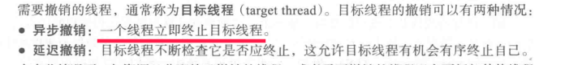

### 4.6.1系统调用fork和exec

作者讲述了如果线程内fork，系统是否为产生的新进程复制所有线程的问题，以及fork后如果exec的时机不同，是否有必要复制线程的问题

### 4.6.2信号问题

Unix，Linux下叫做信号(Signal)。Windows称为消息。
Linux下可以通过kill、raise、alarm、pause这些信号处理系统调用来实现。

信号是由用户、系统或者进程发送给目标进程的信息，以通知目标进程某个状态的改变或系统异常。
信号是事件发生时对进程的通知机制，有时也称之为软件中断，它是在软件层次上对中断机制的一种模拟，是一种异步通信的方式。
信号可以导致一个正在运行的进程被另一个正在运行的异步进程中断，转而处理某一个突发事件。
注意，信号只是用来通知某进程发生了什么事件，无法给进程传递任何数据

进程内部异常或者出错等原因，产生的信号是同步信号，这时候信号会发送到这个出错的进程。

异步信号是进程以外的事件产生的，啥时候会产生，不确定，因为发送信号的进程和接收信号的进程是异步运行的。

信号处理程序负责对接收的信号做出适当的处理。可以是缺省的信号处理程序（系统内核驱动、实现），也可以是用户定义的信号处理程序。从这一点上来看，有些像windows对消息的处理。比如点击windows窗口右上角，默认处理是关闭窗口，但是实际上我们可以改写对WM_CLOSE消息的处理，实现其他操作。

单线程程序，信号发给进程即可

多线程程序，信号传递分为四种情况：


具体怎么传递还取决于信号的类型，书上有解释。

Windows的APC（异步过程调用）模拟信号支持，并且APC直接把信号传递给线程，而不是进程。

 至于windows APC和 windows窗口程序编程时候的消息处理之间的关系，网上找不到资料，有必要可以问老师。书上也没有对APC举例，可能怕说的越多，引申的越多，越麻烦。先让大家有个基本印象。

### 4.6.3线程撤销

书上对于线程的撤销，有两种情况：



这点有疑问，一个线程可以“立即终止”别的线程吗？如果这样子，目标进程正在打开的文件、正在共写的内存怎么办？如果资源已经被目标线程加锁了，其他线程无法使用怎么办？

pthread_cancel(tid)可以给线程发送终止信号，这个函数返回值=0,表示终止成功，否则终止失败。

书上说的三种撤销模式，其实对应的是两个函数：

```
设置本线程对Cancel信号的反应
int pthread_setcancelstate(int state, int *oldstate);
state有两种值：PTHREAD_CANCEL_ENABLE（缺省）和PTHREAD_CANCEL_DISABLE
分别表示收到信号后设为CANCLED状态和忽略CANCEL信号继续运行；old_state如果不为NULL则存入原来的Cancel状态以便恢复。

设置本线程取消动作的执行时机
int pthread_setcanceltype(int type, int *oldtype);
type由两种取值：PTHREAD_CANCEL_DEFFERED和PTHREAD_CANCEL_ASYCHRONOUS
仅当Cancel状态为Enable时有效，分别表示收到信号后继续运行至下一个取消点再退出和立即执行取消动作（退出）；oldtype如果不为NULL则存入运来的取消动作类型值。
```

 举一个简单的例子：

```cpp
#include <stdio.h>
#include <pthread.h>
#include <unistd.h>
#include <stdlib.h>
void *thread_Fun(void *arg)
{
    pthread_setcancelstate(PTHREAD_CANCEL_DISABLE,NULL);
    printf("新建线程开始执行\n");
    sleep(100);
    return 0;
}

int main()
{
    pthread_t myThread;
    void *mess;
    int value;
    int res;
    //创建 myThread 线程
    res = pthread_create(&myThread, NULL, thread_Fun, NULL);
    if (res != 0)
    {
        printf("线程创建失败\n");
        return 0;
    }
    sleep(1);
    //向 myThread 线程发送 Cancel 信号
    res = pthread_cancel(myThread);
    if (res != 0)
    {
        printf("终止 myThread 线程失败\n");
        return 0;
    }
    //获取已终止线程的返回值
    res = pthread_join(myThread, &mess);
    if (res != 0)
    {
        printf("等待线程失败\n");
        return 0;
    }
    //如果线程被强制终止，其返回值为 PTHREAD_CANCELED
    if (mess == PTHREAD_CANCELED)
    {
        printf("myThread 线程被强制终止\n");
    }
    else
    {
        printf("error\n");
    }
    return 0;
}
```

上面的代码编译需要加上 -lpthread参数。

如果线程函数里面注释掉：pthread_setcancelstate(PTHREAD_CANCEL_DISABLE,NULL); 则正常情况下，程序运行一秒后就会终止这个线程。但是现在设置了线程关闭了取消信号的反应，则线程就不会被终止，一直等待100秒结束运行。

所谓的撤销点，就是告诉线程，运行到这个语句才可以退出。上面的代码我们对thread_Fun函数做一下修改，设置一个撤销点：

```cpp
void *thread_Fun(void *arg)
{
    pthread_setcancelstate(PTHREAD_CANCEL_DISABLE,NULL);    
    printf("新建线程开始执行\n");
    sleep(10);
    printf("现在可以终止线程了!");
    pthread_setcancelstate(PTHREAD_CANCEL_ENABLE,NULL);
    pthread_testcancel();    
    printf("这是撤销点以后的语句，不会被执行");
    return 0;
}
```

pthread_testcancel()需要配合pthread_setcancelstate才可以正常起作用，上面的代码如果屏蔽掉两行pthread_setcancelstate，则会在printf("现在可以终止线程了!");之前就被终止。

但是如果把sleep()换成一个for循环，当for循环执行时间比较短，撤销点貌似无效，最后一个printf语句仍然会执行，加入for循环比较耗时，则撤销点以后的语句不会执行。

不知道原因。不知道pthread文档不推荐异步撤销，有么有因为这些奇怪问题的原因。

### 4.6.4线程本地存储

又叫线程局部存储，其实就是线程私有的全局变量。

c语言中这么实现：__thread int g = 0;

这样子，每一个线程就有一个私有的全局变量 int g.

### 4.6.5调度程序激活

前面总结过，用户线程对内核来说是看不到的，内核以进程为调度对象，进程内部有什么操作，或者线程，内核不知道，所以用户线程不能利用多处理器系统的优势，线程只能轮番在所属进程的CPU时间片内运行。

当操作系统要支持多线程的时候，内核就需要知道进程有多少个线程，如何切换线程，如何为多线程分配多个CPU，要做到这些，其实就相当于把线程当作进程看待了，需要一个类似PCB的数据结构来管理线程，这个数据结构就是LWP（想起来1.3节我们第一个多线程程序运行的时候，debug out的输出吗？）
