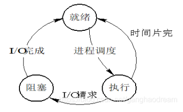

这一章讨论CPU资源的调度。

## 5.1基本概念

首先针对文中出现的“操作系统从该进程接管CPU控制”做个总结。

CPU虽然复杂，但是CPU执行时候并不知道自己执行的是操作系统代码还是用户程序代码，一个程序如果在被CPU运行，操作系统怎么接管CPU？毕竟操作系统的代码想要接管CPU也需要CPU执行啊，而此时CPU是被用户进程占用的。

一般情况下，操作系统接管CPU的方式是中断，各种中断，包括软中断和硬中断。比如CPU时钟产生的中断，见以前总结的 1.5.2节。

另一个曾经困扰我的问题是：如果系统中没有用户作业（用户进程）运行了，内核接管了CPU，内核在干什么？内核程序既然也是代码，内核代码这时候运行了，那么CPU的表现应该是一直在忙碌的运行，而不是空闲状态，以至于还有多余的时间片分配给其他任务。事实上内核没有那么忙碌，操作系统设计了一个任务叫做“空闲任务”，当用户任务被处理完以后，内核会调度这个“空闲任务”，而这个任务的功能就是执行CPU的挂起指令，让CPU挂起，大概就像休眠一样。

### 5.1.1CPU-I/O执行周期

这一节有点怪，我看懂了每一个字，每一句话，也知道作者说了啥，但是不知道该总结啥。

或许说来说去还是想把进程分为：CPU密集型 和 IO密集型两个类别吧。

### 5.1.2CPU调度程序

再次提到短期调度，看书上。

就绪读列未必是数据结构上的队列，可以是FIFO，优先队列、树或者无序链表等，队列的元素就是PCB（前面也说过）

先回顾三种基本态的转换：

书上总结了CPU调度的四种情况：

1. 当一个进程从运行状态切换到等待状态时(例如，IO 请求，或 wait() 调用以便等待一个子进程的终止)。 

2. 当一个进程从运行状态切换到就绪状态时(例如，当出现中断时)

3. 当一个进程从等待状态切换到就绪状态时(例如，IO 完成)。

4. 当一个进程终止时。

**CPU调度不是“从就绪队列选择一个进程运行”吗？和上面的四种状态有啥关系？**

 这里先做个记号。

我总结作者的本意是：

所谓的CPU调度，其实就是进程调度。

### 5.1.3抢占调度

非抢占式调度：我的理解（结合其他书籍），就是即便一个高优先级的进程进入就绪队列，操作系统也不会放弃当前的运行进程而去运行高优先级的进程。

抢占式调度存在的问题就是“竞争”的问题：

1. 比如两个用户优先级不同的进程共享同一数据的时候容易出现问题。进程A还没有更新数据，进程B已经抢先开始读取数据了。

2. 同1一样，内核中也存在类似的问题，因为内核也存在多个进程共享的数据。

3. 还有一个是中断，因为同一个中断号调用同一段代码，影响的是同一个数据，解决办法通常是在进程A调用中断后，系统禁用这个中断，避免其他进程再次调用这个中断，进程A的中断处理完成后，再启用这个中断。

### 5.1.4调度程序

有的教材称为调度器。这一节没啥难于理解的内容。

