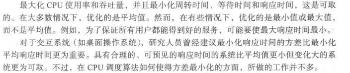

## 5.2调度准则

也即是说衡量调度算法的几个指标：

1. CPU使用率：CPU应该尽可能忙碌。

2. 吞吐量：一个时间单元内进程完成的数量。

3. 周转时间：从进程提交到完成的时间段称为周转时间。这个时间段包含：等待进入内存的时间+在就绪队列的时间+在CPU执行的时间+IO时间

4. 等待时间：进程在就绪队列等待的时间和。这是唯一受调度算法影响的时间。

5. 响应时间：从提交请求到产生第一响应的时间。如果书上的这个定义有些不好理解，那么其他资料对响应时间的定义：自进程就绪至进程第一次获得CPU响应的时间（Response time is the time spent when the process is in the ready state and gets the CPU for the first time），响应时间计算公式：

        Response time = Time at which the process gets the CPU for the first time - Arrival time（中间是减号）

系统调度的目标就是优化这几个指标 :

