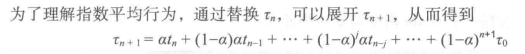
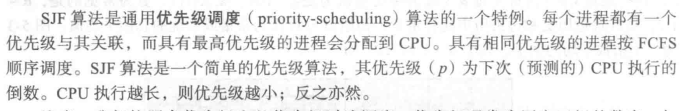
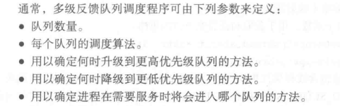

## 5.3调度算法

调度算法要处理的问题就是从就绪队列选择进程，并为其分配CPU运行。

通常有以下算法思想：

### 5.3.1先到先服务（FCFS）

这种测略很简单，数据结构讲过，不再赘述。这是非抢占式的调度。

缺点书上有

### 5.3.2最短作业优先调度(SJF)

SJF算法中，下次CPU执行长度无法准确预测，一般采用如下测略：

1. 批处理系统由用户输入自己估计的执行长度。书上说：“<mark>SJF调度常用于长期调度</mark>”，不知道这句话的意思是“批处理系统的长期调度”还是“所有系统的长期调度”。

2. 根据“下一个CPU长度近似与以前的CPU长度”，根据以前的CPU长度近似计算下一个CPU长度。

        下次 CPU 执行通常预测为以前 CPU 执行的测量长度的指数平均。计算公式如下：

```math

        设t_n为第n个CPU执行长度，\tau_{n+1} 为下次CPU执行预测长度，则定义\\\

          \tau_{n+1}=at_n+(1-a)\tau_n, a为一个[0,1]之间的权重系数，一般a设置为\frac{1}{2}

```



SJF可以是抢占或者非抢占的。抢占算法会抢占当前正在运行进程的CPU，非抢占则等待当前进程完成CPU执行。

抢占SJF有时候称为**最短时间优先**。记住，是最短剩余时间优先，而不是最短执行时间优先。

### 5.3.3优先级调度



优先级的定义可以是内部的（比如内存需求、时限等），也可以是外部的（比如支付的费用等）

优先调度可以是抢占或者非抢占。

优先级调度算法的缺点是无穷阻塞或者饥饿：无穷阻塞或饥饿的意思是一个进程由于优先级过低，导致很长的时间一直都没执行。二者是一个意思。解决方案就是“老化”：就是每隔一段时间递减等待进程的优先级数值（等同于提高它们的优先级），最终，最低优先级的进程会编程最高的优先级。

### 5.3.4轮转调度（RR）

- 轮转调度算法是专门为分时系统设计的。它类似于FCFS 调度，但是增加了抢占以切换进程。
- 定义一个较小时间单元，称为**时间片**。时间片通常为10~100 ms。将就绪队列作为循环队列。CPU 调度程序循环就绪队列，为每个进程分配不超过一个时间片的CPU。

这一节看似内容多，但是没有难点。

### 5.3.5多级队列调度

1. 将线程分为不同的组，每一组采用不同的调度算法。

2. 队列之间也应该有调度，比如前台队列可以比后台队列有更高的优先级

没有难点，不再赘述

### 5.3.6多级反馈队列调度

是对多级队列调度的改进，这种改进允许进程从一个队列迁移到另一个队列，将CPU密集型迁移到更低级的队列，将IO密集型和交互多的进程放到更高的队列。另外，在较为低级队列等待时间较长的进程会被迁移到更高优先级的队列，这是另外一种形式的老化。




