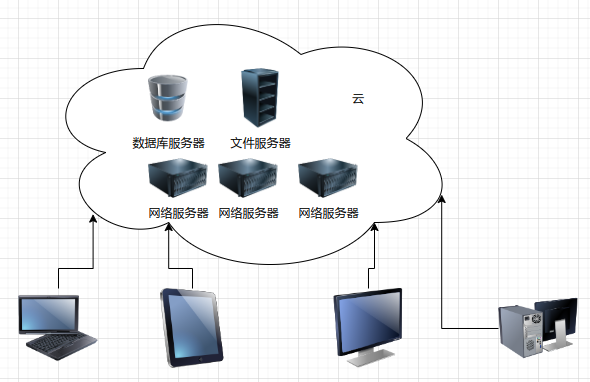
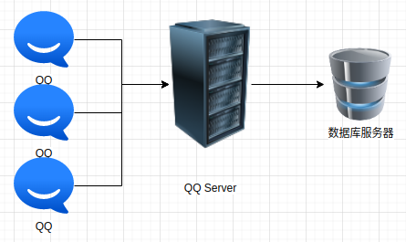
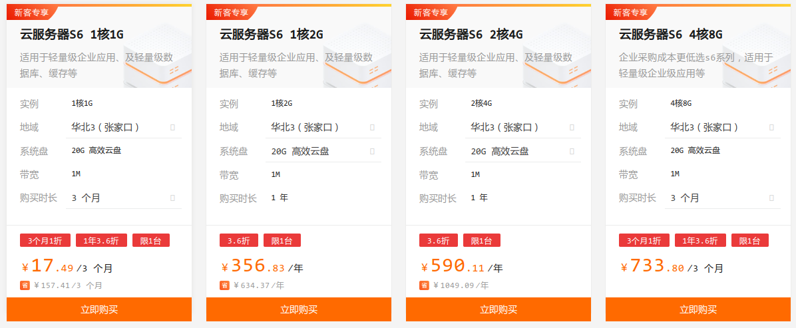

## 1.11计算环境

### 1.11.1传统计算

这一节没啥问题，出现了一个名词：瘦客户端。可以理解为功能很简单的客户端，基本上没有程序处理能力，只负责将键盘输入传送到服务器，同时在自己的显示器上显示服务器传回的结果。

对应的概念是胖客户端，具有丰富功能，较强的运算能力，可以独立完成任务。其实就是一台PC计算机。

### 1.11.2移动计算

没啥难点

### 1.11.3分布计算

前面1.3节讲集群系统的时候，大概可以模糊的知道什么是分布计算。

概念书上有，没啥可说的。

分布式计算的前提是一个本身很复杂的、但是可以分解为大量简单的计算片段的任务，才更适合分布式计算。

和分布式计算对用的是“集中计算”。各有优缺点，集中计算的思路刚好和分布式计算相反。集中计算是一个性能很高的服务器负责计算。

现在还有一个很火的概念叫云计算。sun服务器公司的经理曾经说：运计算就是服务器计算，故弄玄虚。说的也对也不对。

对于众多客户端来说，云计算服务端就像一个整体，像一个超级计算机，看起来是集中计算，客户不知道服务器端是什么情况。

但是云计算的服务端，却是地地道道的分布式计算，成千上万台服务器（也可能采用普通PC，比如谷歌）分工合作，为用户的计算提供服务。简单如下图：

### 1.11.4客户-服务器计算

客户-服务器（C/S：Customer/Server）计算现在很普遍，我们现在的很多应用都是客户服务器计算模式，比我我们的聊天软件，客户端就是QQ、微信等，它们都有自己的服务端程序。甚至服务器程序还是其他服务器软件的客户端，比如QQ的软件架构大致如下：

QQServer和QQ建立网络连接和通信，负责QQ登录认证，消息转发等，但是用户的信息存放在数据库服务器里面，QQ Server还要读取数据库信息，这时候QQserver的角色就是客户端，数据库服务器就是服务端。

另一个特殊的客户服务器计算是浏览器和互联网WEB服务器。称为B/S（Browser/Server）模式计算。

客户服务器计算和瘦客户端的区别是：CS模式下，客户端具备计算能力，并且参与部分计算。比如浏览器客户端，对服务端传来的HTML数据要解析，并用特定的格式渲染出来，呈现给用户。还要负责JavaScript脚本代码的解释运行，网页多媒体的播放等。而瘦客户端则不存在计算，一切都是服务器计算好，客户端负责显示结果画面即可。

### 1.11.5对等计算

 对等计算又称端对端计算（Peer To Peer,P2P），或者点对点计算。这个模型不区分客户和服务器。或者说，每一台计算机不但是客户端也是服务端。P2P软件应用很广，典型的比如很多下载软件迅雷等。我们在用迅雷下载软件的时候，不但会从下载网站提供的链接地址下载，迅雷还会多开几个线程，从其他用户的电脑下载这个软件（如果这个用户的计算机有这个软件，而且是通过迅雷下载的），同样的，如果其他用户通过迅雷下载这个软件的时候，我们计算机上的迅雷会作为服务器，为他们提供下载的数据。这其实就是我为人人，人人为我的思想。

对等计算的优点就是可以解决服务器瓶颈的问题。比如我架设了一个下载网站，我租用的服务器可能性能不是多强大，服务器的网络带宽也不是多大，下载用户稍微多一些，服务器就会卡死，而P2P方案就可以缓解服务器瓶颈问题，因为很多下载连接和数据是下载工具从互联网其他计算机获取的。

1）节点计算机加入对等网络的时候，需要在网络的集中查询服务中注册服务。举例来说，迅雷下载的时候如何知道哪一个用户的迅雷下载过哪些文件？或者如果你的迅雷要为其他用户提供下载服务，别人计算机上的迅雷如何才知道你有他需要的文件数据？这时候需要一个网络集中查询服务来管理这些信息。

2）另外一种方案是没有集中查询服务，所有的节点在网络中，对网络的所有节点广播服务请求，就像人拿着大喇叭到处喊：我这里有什么数据，需要的来下载。或者喊：我需要数据，谁有？为了实现这一点，应该提供一种发现协议。

这样的协议比如<mark>简单服务发现协议（SSDP，Simple Service Discovery Protocol）</mark>是一种应用层协议，是构成通用即插即用(UPnP)技术的核心协议之一。
简单服务发现协议提供了在局部网络里面发现设备的机制。控制点（也就是接受服务的客户端）可以通过使用简单服务发现协议，根据自己的需要查询在自己所在的局部网络里面提供特定服务的设备。设备（也就是提供服务的服务器端）也可以通过使用简单服务发现协议，向自己所在的局部网络里面的控制点宣告它的存在。 

个人认为，任何发现协议都必须在同意局域网内，跨越不同网络的发现协议无法实现。

### 1.11.6虚拟化

虚拟化是一种软件技术，用于实现模拟。虚拟化技术的典型应用是各种虚拟机，一般有两种，系统虚拟机和程序虚拟机。

系统虚拟机是模拟一个完整的计算机系统，我们可以在这个虚拟机上安装运行其他操作系统。比如VMWare和VirtualBox，还有各种各样的案桌模拟器。

程序虚拟机转为执行某种程序设计，比如java，python，android。举例来说，java为什么说他是虚拟机？因为java设计的有完整的硬件架构，比如CPU，寄存器，以及CPU指令等。

虚拟机上面还可以运行虚拟机，比如我们的vmware虚拟机上，可以安装java，python等

### 1.11.7云计算

前面简单提到了运计算。

“从某方面来看，云计算是虚拟化技术的延伸”。这句话我觉得应该这么理解。云计算是云计算，虚拟化是虚拟化，两者本来没有一毛钱关系，但是现在的云计算大量运用了虚拟化技术，所以作者才这么说。举例如下：

我们选择一个云计算服务商作为自己的个人网络服务器提供者，这些服务商往往会列出一大堆各种配置套餐供我们选择，比如阿里云提供的如下图：

这些服务器配置各不相同，甚至操作系统也可以定制选择，问题时，阿里云的用户上百万，阿里云真的准备了这么多配置不同，系统不同的服务器吗？显然不是，这些服务器都是清一色的虚拟机。

另一个名词：SaaS：软件即服务。服务商提供软件服务，但是不卖软件。收费按照一定的策略，比如每年收费多少，各个功能模块如何组合收费等等。国内厂商现在也这么做，甚至更夸张，不但软件出售要收费，每年还收取服务费。

PaaS：平台即服务。把服务器平台作为服务的方式，比如我们在阿里云购买主机平台。阿里云提供的就是这种服务。PaaS提供的是一个完整的开发和部署环境。

IaaS：基础设置即服务。指把IT基础设施作为一种服务通过网络对外提供，并根据用户对资源的实际使用量或占用量进行计费的一种服务模式。比如有钱的公司可以在电信的中心机房租用服务器和网络资源。

### 1.11.8实时嵌入系统

因为实时系统对系统的响应速度要求很高，分时系统肯定不能满足要求。但是Linux内核因为是开源的，所以可以被魔改成实时系统。

其他内容没啥难点，就是科普知识。
