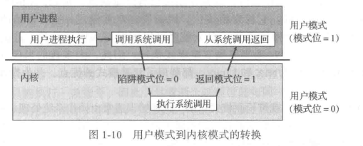

## 1.5操作系统的执行

先弄清楚几个开头的概念和相关的概念

1）硬中断和软中断：前面解释过，就是硬件和软件分别引起的中断

2）中断还可以分为内中断和外中断：外部设备引起的中断就是外中断。CPU内部引起的中断是内中断。狭义上的外中断，一般就是我们所说的中断。内部中断一般是由于CPU内部运行出错产生的中断，也包括CPU在特定情况下自身启动的中断。比如CPU运行除0会产生内中断，当单步调试程序的时候，CPU每执行一个步骤，产生一个内中断。

3）异常：异常就是程序执行过程中的异常行为。比如除零异常，缓冲区溢出异常等。所以异常就是内中断

4）陷阱：操作系统运行在内核态，在内核态中，操作系统具有对所有硬件的完全访问权限，可以使机器运行任何指令；相反，用户程序运行在用户态，在用户态下，软件只能使用少数指令，它们并不具备直接访问硬件的权限。这就出现了问题，假如软件需要访问硬件或者需要调用内核中的函数该怎么办呢，这就是陷阱的作用了。陷阱指令可以使执行流程从用户态陷入内核（就是CPU转而执行内核的功能，这也就是为什么叫做陷阱）并把控制权转移给操作系统，使得用户程序可以调用内核函数和使用硬件从而获得操作系统所提供的服务，比如用视频软件放一个电影，视频软件就发出陷阱使用显示器和声卡从而访问硬件。

由于陷阱是在程序运行时候产生的，陷阱是内中断，也是软中断。

网上有一种资料说：内*中断*一般称为*陷阱*(trap)或异常。可能是因为陷阱和异常都是因为CPU执行当前指令引起的吧

### 1.5.1双重模式与多重模式

前面说过，为了操作系统的稳定和安全，操作系统内核程序和用户程序分别运行在两种不同的模式，就是区别对待的意思。内核模式的程序和用户程序在系统内存的不同区域，称为内核区域和用户区域，内核程序运行在内核区域，但是可以访问用户区的数据，用户程序运行在用户区域，但是不能访问内核区域的数据。而且计算机还从硬件上保证这一点。

好像很合理，想想以前的DOS系统时代，病毒多猖狂，动不动鸠占雀巢内存中的内核程序的位置，代替操作系统发号施令，不关机用软盘引导，你就杀不掉病毒。

有的书籍把模式（mode）翻译成“态”，用户模式、系统模式就换了名字：用户态和内核态。我倾向于后者，因为可以少打一个字。

当用户要申请系统的特定功能的时候（系统调用），系统就从用户态切换为内核态，同时CPU内部一个专用寄存器的模式位变为0,。。。，具体过程书上的图画得挺好，利用如下：

双模式可以保护操作系统，禁止用户程序执行一些直接操作硬件的低级指令，大部分是特权指令。比如DOS时代，我们可以在程序里面轻松的实现读写磁盘的引导记录扇区，通过多种手段将磁盘引导的内容从系统内核改成自己病毒代码，这样子感染病毒的软盘引导系统的时候，第一个执行的就是病毒程序。

除了双重模式，还有多重模式，这时候CPU内部需要表示模式的“位”就需要多个。

一种特殊的模式是虚拟机模式，这种模式下，虚拟机进程的权限大于用户模式，小于内核模式。我的理解是这样的，比如windows系统上跑了一个虚拟机进程vmware，这个进程对于windows来说是用户态，但是比用户态权限高，他不能随意访问内核的数据和代码段区域，但是他可以被授权使用内核的一些高权限接口，比如创建虚拟网卡并且设置网络连接。对于虚拟机内部的应用来说，他能分区硬盘，直接读写IO，拥有最高的内核权限。网上查不到，只能自己脑补。

P22页第2段第4行说“有时候不同的内核组件也会使用不同的模式”，没有举例，想象不出来。

“系统调用通常会陷入中断向量的某个指定位置”。这句话的意思其实前面也分析过。为社么要请求系统调用？因为需要访问一些系统不允许我们访问的设备或者资源，但是我们编程确实又需要能访问这些资源，操作系统就提供接口，我们在程序中访问这些封装好的接口函数，就变相实现了访问那些资源（比如我们读取文件，可以不必关心是硬盘还是软盘，是FAT分区还是NTFS分区），这也是系统调用的好处，内核访问这些资源必然会涉及IO中断，这时候，系统状态从用户态到内核态，就是陷入（trap），并且底层实现用到了中断。所以说“系统调用通常会陷入中断向量的某个指定位置”。至于后面说的trap指令和syscall指令，应该是不同架构CPU的专用指令。

硬件支持的双模式或者多模式，在一定程度上保护了系统安全。以前有很多游戏修改器，这种程序运行时，可以访问其他游戏进程所在的内存空间，修改游戏在内存中的数据，比如修改人物角色的攻击力、生命值等，现在这种东西貌似已经绝迹，原因就是计算机系统从软件到硬件对双重模式的支持。

### 1.5.2定时器

计算机系统有一个系统时钟，每隔一定的时间就会产生一个时钟中断，强迫系统进入内核态，以免用户程序因为某种原因无限或长期占用CPU。

这个系统时钟虽然是硬件，但是必须是可编程的，也就是说可以被操作系统改变设置，比如设置中断产生的周期。
