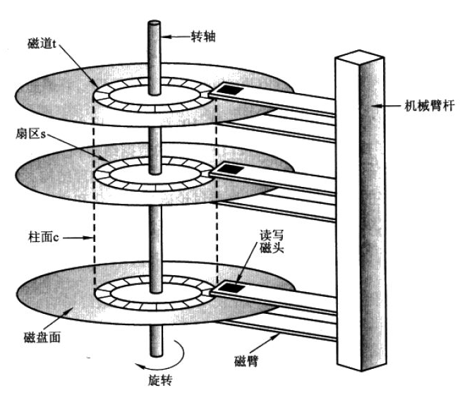
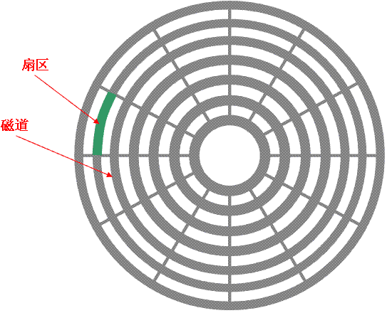
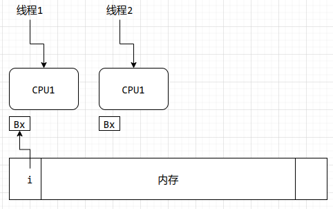
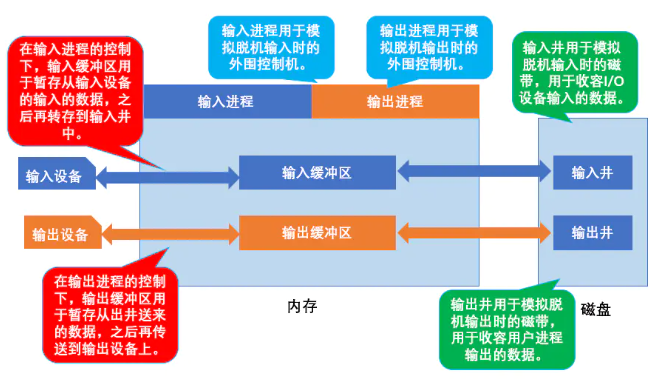

## 1.8存储管理

操作系统对存储设备的访问做了抽象。比如磁盘，我们看到的文件、目录等，在底层实际上对应着一个个的磁道和扇区等。操作系统让我们对磁盘的访问变得简单。

下面是硬盘的结构演示图：

### 1.8.1文件系统管理

操作系统负责文件管理的以下内容：

1. 创建删除文件。通常删除一个文件，并不会真的将文件所在的磁盘数据真正清零（就像磁带机的磁头擦除磁带那样），而是修改磁盘上的文件分配表（文件分配表是以前FAT分区创建的名词，现在的其他分区格式不知道是不是这个名字，但是基本上也都有类似的数据结构存储磁盘上的目录和文件信息），删除这个文件在分配表中的信息即可。这样子这块无主之地就可以被再次利用。

2. 创建和删除目录。虽然目录有时候也被认为是文件的一种（比如Linux系统），但是目录并不占用实际的磁盘空间，以FAT文件系统为例，目录其实就是文件分配表中的一条数据，或者是树状文件系统结构中的一个特殊属性的节点。
   
   一个有趣的现象，Linux系统中中每一个目录和文件都有一个inode编号，但是linux支持的inode数量是有限的，如果你在磁盘上写了一大堆文件名，数量超出了linux可以分配的inode数量，那么就算实际上磁盘还有很多空间，系统也会提示磁盘空间不足。

3. 映射文件到外存：我的理解，意思就是把我们通过操作系统看到的文件，和存储设备上实际的存储位置对应起来，比如文件在哪一个磁道，占用哪几个扇区。注意一下，文件在外存（尤其是磁盘）上的存放不一定是连续的，可能这里存放文件的一部分，那里又一部分。这些都依靠表信息维护。以前的FAT文件系统就是这样子，导致一个缺点就是文件访问速度慢，引起的原因很简单，频繁的文件创建和删除操作，形成了很多碎片区域，你新建的文件，很可能分配在不同的碎片区域，导致文件存储不连续。那时候很流行整理文件碎片，以略微提高系统性能，其实就是把文件重新在磁盘上腾挪，尽量让同一个文件的数据存放在相邻的扇区，这样子的话，磁盘旋转起来，机械磁头扫描一下就能读取文件所有数据。现在的win10，win11系统还有这个功能。

4. 备份文件到稳定存储介质。

### 1.8.2大容量存储管理

操作系统负责硬盘管理的以下活动：

1. 空闲空间管理。所有的空闲空间都要标记、管理，以便于分配利用

2. 存储空间分配。比如对于大的文件，决定是在多个碎片空间写数据还是利用连续的大空间。

3. 硬盘调度。比如多个进程都需要访问硬盘的文件，但是硬盘的数据访问需要移动磁头，旋转磁盘等机械步骤，这时候就需要硬盘调度算法，争取用最短的时间，让所有进程都获得数据。就像快递员送快递，尽量走最短的路，送出最多的快递。

### 1.8.3高速缓存

这里说的高速缓存和前面说的硬件里面的高速缓存不同（比如硬盘控制器里面的高速缓存，CPU内部的高速缓存），这里只讨论受操作系统控制的高速缓存，而且这是一个相对概念。比如寄存器相对于内存来说，是内存的高速缓存，内存相对硬盘来说，是硬盘的高速缓存。

* 所有缓存或者高速缓存都存在于低速设备和高速设备之间，用于提高系统效率。如何提高效率？举两个例子：
1. 假如CPU要计算整数i的连续加法i++，如果i存在于内存中，我们知道，内存存取速度比CPU速度慢很多，如果CPU再通过总线访问内存，速度受更慢的总线速度影响，会更加慢，每次执行完加速都要修改内存数据，效率太低，如果把i放入寄存器，那么寄存器中的数据，就可以和CPU运算速度一样的速度更新，计算完毕后，用寄存器里面的数据代替内存中的i即可。

2. 在比如CPU访问硬盘数据，我们的程序访问一个文本文件，每次读取一行，如果每次读取一行数据都去访问硬盘，效率可想而知。最合适的办法就是把硬盘的文件数据都读取到内存里面缓存起来，CPU发现内存里面有文件数据，只需要访问内存即可。

高速缓存有优点，但也带来一些问题。我们知道，duo处理器系统，每一个处理器都有自己寄存器，如下图：

如果系统有两个CPU，程序有两个进程要访问内存中的变量i,这时候A可能出现在两个CPU的寄存器BX中（也可能是其他寄存器，暂时就认为是BX吧），这时候，操作系统就要保证如果一个寄存器的值更新，另一个寄存器中的i值也要同步更新。“保护高速缓存的一致性”。另外我们用常规思路分析，系统还要确保：两个线程不能同时写寄存器BX，如果线程1执行i+=1，线程2执行i+=2，用哪个更新哪个？

再想得更复杂一些，如果系统是分布式的，则更复杂，试想如果网络上的多个计算机都要修改某一台计算机上的某一条数据库数据，该怎么办？

### 1.8.4I/O系统（反斜杠难打，以后我就直接写IO）

操作系统的目的之一就是为用户隐藏硬件设备的具体特征，比如IO子系统，我们在使用硬盘和优盘存储文件，编辑文件的时候，感觉不到二者的区别。

IO子系统包括以下几个组件：

1. 包括缓冲区（buffer）、高速缓存（cache）和假脱机的内存管理软件：所谓缓冲区就是在内存中开辟的一段空间，也是用于在速度不匹配的两个设备之间暂存数据。
   
   * 两个名词的中文翻译很像，英文不同，但是还有区别，缓冲区常用于高速设备向低速设备传递数据，比如CPU控制打印机打印文件，打印机端口很慢，打印更慢，CPU如果一点点的频繁传递数据，效率太低，于是就在内存中开辟一个缓冲区，一次性的把打印数据放进去，让打印机自己慢慢边读取边打印，就像上游泄洪，担心洪水一下子淹没下游，就在中间搞一个缓冲的水库，就可以在不妨碍上游泄洪的情况下，一边蓄水一边泄洪。
   
   * 高速缓存用于数据的复用，有些数据经常用到，平凡访问慢速设备效率太低，于是就把慢速设备上的数据缓存到高速存储中，用完以后再更新慢速存储设备上的数据。
   
   * 假脱机：先说什么是脱机，很简单，就脱离连接。这种连接可以是和计算机主机的连接，也可以是网络连接，比如脱机浏览网页，就是不联网访问缓存的网页数据。以前的批处理系统有一种脱机处理机制，其实就是在主机之外另设一台小型微型机，该机只与外部设备打交道，把要处理的信息成批地输入到高速的辅助存储器（磁带或磁盘）中，再把辅助存储器与主机连接起来。主机仅从高速的辅助存储器中调入信息进行处理，作业完成后，处理结果和有关信息以文件形式存于辅助存储器中，然后再把它们转移到微型机去输出。
   
       假脱机：又称SPOOLING （即外部设备联机并行操作），即Simultaneous Peripheral Operations On-Line的缩写，它是关于慢速字符设备如何与计算机主机交换信息一种技术,物理上慢速设备和主机连接，但是数据处理并不是脱机处理，而是在主机硬盘上创建两个文件用于输入和输出（称为输入井和输出井，这两个文件叫做井文件），输入输出井用于模拟脱机处理时候的低速磁带设备，同时在内存开辟输入缓冲区和输出缓冲区，输入缓冲区用于暂存由输入设备传送的数据，之后再传送到输入井。输出缓冲区用于暂存从输出井传送的数据，之后再传送到输出设备。
   
   假脱机需要系统支持多进程并发才可以实现，过程还可以参考下面的图：
   
   
   
   利用假脱机技术可以实现打印机共享。不需要知道具体细节，感兴趣可以百度。

2. 设备驱动器的通用接口，这里的接口就是操作系统封装好的调用接口。比如API。

3. 特定硬件设备的驱动程序。前面我们分析总结过中断和硬件驱动的关系。
